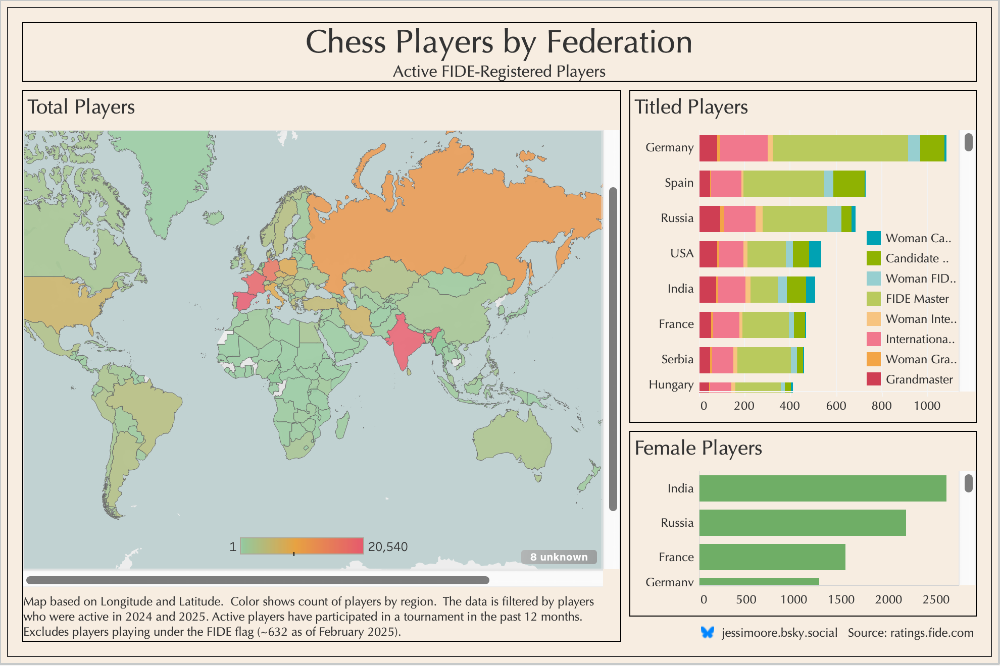

One of my first finished Tableau visualisations can be viewed [here](https://public.tableau.com/shared/G4P9BJHTW?:display_count=n&:origin=viz_share_link) (best viewed on a large screen). I am finding the FIDE chess player data to be a really great source for data exploration, so I looked at another (more traditional) way to visualise the chess federations - as opposed to my creative visualisation [here](https://jessjep.github.io/2024/11/23/chess-federations.html).

I wanted to do a lot more with this; specifically, I wanted to animate it by date to show the change over time. This was easy enough to achieve, however, achieving the dynamic sorting (from most to least, changing by year) of the bar charts was not so easy, and something I'll have to play around with a little more.

```{=html}
<div class='tableauPlaceholder' id='viz1742441159629' style='position: relative'><noscript><a href='#'></a></noscript><object class='tableauViz'  style='display:none;'><param name='host_url' value='https%3A%2F%2Fpublic.tableau.com%2F' /> <param name='embed_code_version' value='3' /> <param name='path' value='shared&#47;G483SQ22M' /> <param name='toolbar' value='yes' /><param name='static_image' value='https:&#47;&#47;public.tableau.com&#47;static&#47;images&#47;G4&#47;G483SQ22M&#47;1.png' /> <param name='animate_transition' value='yes' /><param name='display_static_image' value='yes' /><param name='display_spinner' value='yes' /><param name='display_overlay' value='yes' /><param name='display_count' value='yes' /><param name='language' value='en-US' /></object></div>                <script type='text/javascript'>                    var divElement = document.getElementById('viz1742441159629');                    var vizElement = divElement.getElementsByTagName('object')[0];                    if ( divElement.offsetWidth > 800 ) { vizElement.style.width='1200px';vizElement.style.height='827px';} else if ( divElement.offsetWidth > 500 ) { vizElement.style.width='1200px';vizElement.style.height='827px';} else { vizElement.style.width='100%';vizElement.style.height='1177px';}                     var scriptElement = document.createElement('script');                    scriptElement.src = 'https://public.tableau.com/javascripts/api/viz_v1.js';                    vizElement.parentNode.insertBefore(scriptElement, vizElement);                </script>
```

{style="margin:auto;"}
